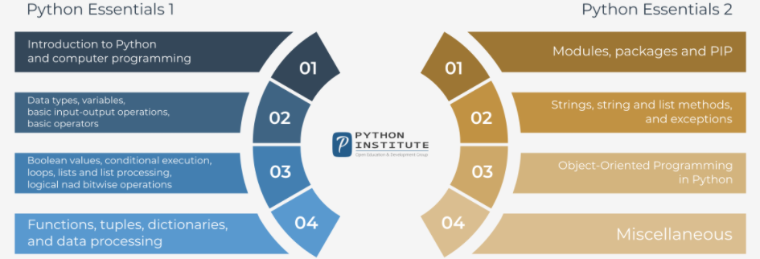
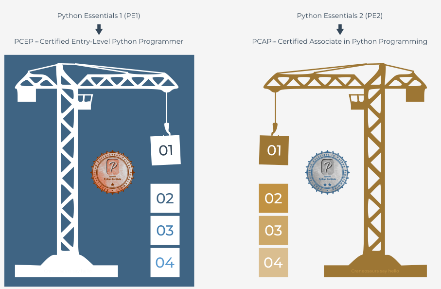
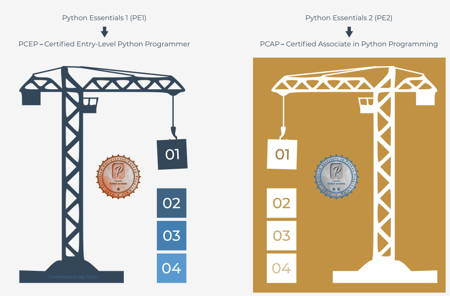

## Acerca do currículo do curso

***PCAP: Programming Essentials in Python*** (forma curta: *Python Essentials*) é uma série de dois cursos que abrange todos os conceitos básicos de programação em Python, bem como conceitos e técnicas gerais de programação de computadores, e a abordagem orientada a objetos.

A série de cursos de Python Essentials é dividida em duas partes:

- **Python Essentials 1 (PE1): BÁSICOS**, composto por quatro módulos;
- **Python Essentials 2 (PE2): INTERMEDIÁRIO**, composto por quatro módulos.

Cada aluno tem acesso a **materiais práticos, labs, questionários, e testes** para aprender a utilizar as competências e conhecimentos adquiridos no curso e interagir com algumas **tarefas e situações de programação da vida real**.

Os alunos que concluírem o curso serão capazes de realizar tarefas de codificação relacionadas com os princípios básicos de programação na linguagem Python, e de compreender as noções e técnicas fundamentais utilizadas na programação orientada a objetos.

Além disso, estarão prontos para tentar as seguintes qualificações:

- **PCEP - Certified Entry-Level Python Programmer**(após concluir o Python Essentials 1)
- **PCAP - Python Certified Associate Programmer** (após completar o Python Essentials 2)
do OpenEDG Python Institute.

*Python Essentials série de dois cursos*

### Certificação de nível básico: PCEP - Certified Entry-Level Python Programmer

*O Python Essentials 1 (PE1) está alinhado com a certificação PCEP - Certified Entry-Level Python Programmer*.

**PCEP - Certified Entry-Level Python Programmer** é uma credencial profissional que mede a capacidade do test-taker para realizar tarefas de codificação relacionadas com os **aspetos essenciais da programação na linguagem Python**.

Um candidato ao teste deve demonstrar conhecimentos suficientes **sobre os conceitos universais** de programação informática, **a sintaxe e semântica** da linguagem Python, bem como ****a capacidade de resolver os desafios típicos de implementação** com a ajuda da Biblioteca Padrão Python.

*PCEP - Certified Entry-Level Python Programmer* mostra que o indivíduo está familiarizado com conceitos universais de programação informática, como **operadores básicos, sistemas numéricos, lógica Booleana, tipos de dados, containers, funções, condições, loops**, bem como a **sintaxe da linguagem de programação Python, semântica, e o ambiente de runtime**.

*PCEP - Certified Entry-Level Python Programmer* é um **passo intermédio** para a certificação PCAP - Certified Associate in Python Programming e **o ponto de partida** para lançar uma carreira no desenvolvimento de software, programação Python, e tecnologias relacionadas.

*A obtenção da certificação PCEP ajudará o titular do certificado a destacar-se dos outros candidatos e a colocar o seu pé na porta*.

*Módulos de curso mapeados com certificações PCEP e PCAP*

### Certificação de Nível Associado: PCAP - Python Certified Associate Programmer

*O Python Essentials 2 (PE2) está alinhado com a certificação PCAP - Python Certified Associate Programmer*.

A certificação PCAP - Python Certified Associate Programmer é uma credencial profissional que mede a capacidade do test-taker de realizar tarefas de codificação relacionadas com *os aspetos mais avançados da programação* na linguagem Python, incluindo as noções e técnicas fundamentais utilizadas na *programação orientada a objetos*.

A certificação *PCAP - Certified Associate in Python Programming* mostra que o indivíduo está familiarizado com todos os conceitos de programação abrangidos pela certificação *PCEP - Certified Entry-Level Python Programmer*, bem como com conceitos como **módulos e pacotes, string e métodos de string, métodos de lista, exceções, programação orientada a objetos, geradores, lambdas, processamento de ficheiros, e trabalho com módulos Python STL selecionados**.

A obtenção da certificação PCAP assegura que o indivíduo está totalmente familiarizado com **todos os meios primários fornecidos pelo Python 3 para lhe permitir iniciar os seus próprios estudos, e para abrir um caminho para a carreira de programador**.

*Módulos de curso mapeados com certificações PCEP e PCAP*

