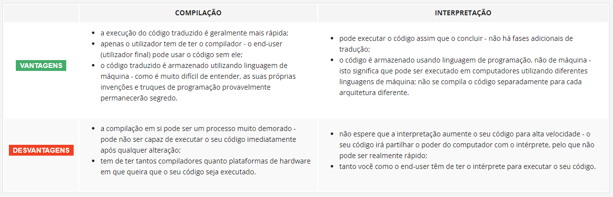

## 1.1.1.1 Programação - Noções Básicas

### Como funciona um programa de computador? :computer:

Um computador sem um programa é o mesmo que um piano sem um pianista, apenas um objeto.

Os computadores atuais são limitados a operações básicas e mesmo para a realização dessas, ele depende de nossa instrução para definir:

**1. os números aceitáveis**

**2. as operações**

**3. como será a exibição dos resultados**

Essas operações formam um programa, todos esses parâmetros serão traduzidos por uma linguagem para que o computador possa entender.

**Linguagem** aqui é a palavra chave.

### Linguagens naturais vs. linguagens de programação 

A linguagem é reconhecida como uma ferramente utilizada para expressa e registras pensamentos.

A linguagem dos computadores é bem básica sendo popularmente conhecida como **Linguagem de máquina**.

De uma maneira geral até o computador de última geração funciona como um cão bem treinado, apenas responde a um conjunto de comandos pré-conhecido.

O conjunto completo de comandos conhecidos é chamado de **lista de instruções** também conhecido como **IL *(Instruction List)***. O tamanho das IL de cada computador pode variar.

### O que faz uma linguagem? 

A linguagem é utilizada para permitir a comunicação. Aplicando isso para o nosso problema com computadores, temos que, a linguagem é a ferramenta(meio) que nos liga a eles, funciona como uma ponte.

A linguagem é constituida pelos seguintes elementos:

1. um alfabeto: conjunto de símbolos usados para construir palavras;
2. um lexis (dicionário): conjunto de palavras que a linguagem oferece aos seus utilizadores;
3. sintaxe: conjunto de regras utilizadas para determinar se uma determinada sequência de palavras é válida ou não para formar uma frase;
4. semântica: conjunto de regras que determinam se uma frase faz sentido;

O ***IL** pode ser visto como o alfabeto de uma linguagem de máquina.* É a lingua materna do computador.

Existem muitas linguagens que nos permitir estabelecer uma conexão com o computador, aquelas mais elegíveis para nos humanos, são chamadas de ***linguagens de programação de alto nível***.

Os programas escritos em linguagens de alto nível são conhecidos como, ***source code*** e o ficheiro que o contém é chamado de ***source file***.

### Compilação vs. Interpretação

O ato de programar é visto como o momento de compor os elementos da linguagem de programação em uma ordem que provoque o resultado desejado.

Imagine que você acabou de escrever um programa todo correto, ou seja, você conseguiu passar com sucesso por todas as etapas descritas abaixo:

**- alfabeticamente** - o programa foi escrito seguindo uma liguagem pré-definida.

**- lexicamente** - foi utilizado o dicionário correto da linguagem escolhida.

**- sintaticamente** - as regras da linguagem foram seguidaas corretamente.

**- semanticamente** - a programação utilizada para criação do programa faz sentido.

Agora você precisará transformar/converter, a linguagem de alto nível, da programação, para a linguagem do computador/a linguagem de máquina. Isso poderá ser feito de duas maneiras:

**1. Compilação** - O programa (*source code*) será traduzido, obtendo-se um ficheiro contendo a linguagem de máquina(*machine code*) que poderá ser executado em qualquer lugar do mundo. Cada vez que o programa sofrer uma modificação em seu código precisará passar por esse processo de tradução novamente.

**2. Intrepretação** - O programador traduz o *source code* toda que vez que precisar executá-lo. Esse processo é realizado por um programa, chamado de intérprete. Dessa maneira o usuário final precisará de um programa para interpretar o código toda vez que precisar utilizá-lo.

De uma maneira geral existem poucas linguagens que possam utilizar ambos os processos, geralmente elas são criadas visando um dos dois.

### O que o intérprete realmente faz?

O programa escrito pelo programador não passa de um pedaço de texto (*source code*).

O intérprete lê o ***source code*** e verifica se todas as linhas subsequentes estão corretas (utilizando os quatro aspetos abordados anteriormente).

A medida que a leitura é feita, o programa vai sendo executado, caso encontre um erro, diferententemente do compilador, o intérprete informa onde se encontra o erro e o que o causou.

Nessa mesma situação o compilador termina o seu trabalho imediatamente. O único resultado, neste caso, será uma mensagem de erro.

É normal nos perguntarmos qual processo seria melhor, compilar ou interpretar? Os dois possuem suas vantagens e desvantagens.

### Compilação vs. Interpretação - vantagens e desvantagens

A tabela abaixo com as caracteristicas dos processos de interpretação e compilação nos ensina muito sobre a linguagem que estamos aprendendo, o Python.

*Vantagens e Desvantagens dos processos de compilação e interpretação - **Fonte: Python Institute, Python Essenstials***

O *Python* é uma linguagem interpretada e isso siguinifica que ela herda tudo todas as características do processo de interpretação. Para programar em Python é necessário possuir um interpretador para a linguagem, mas isso não deve ser  um problema uma vez que o Python é gratuito.

As linguagens criadas para serem utilizadas na forma interpretada são chamadas ***linguagens de scripting***, enquanto os *source programs* codificados que as utilizam são chamados ***scripts***.

>***Fonte**: Curso Python Essentials oferecido pela Python Institute*