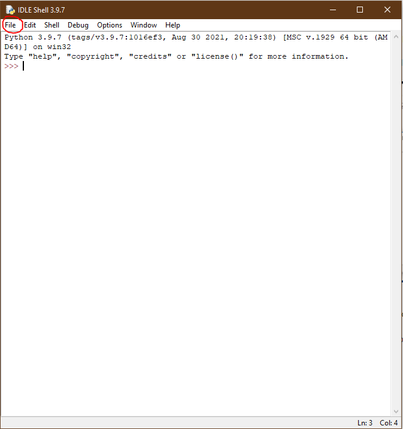
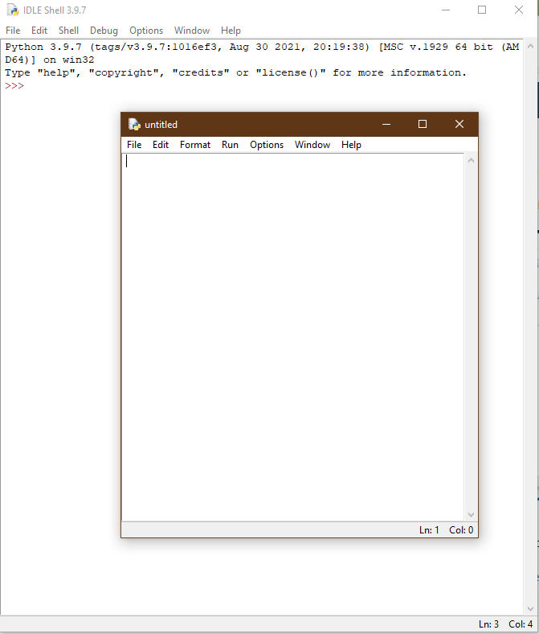
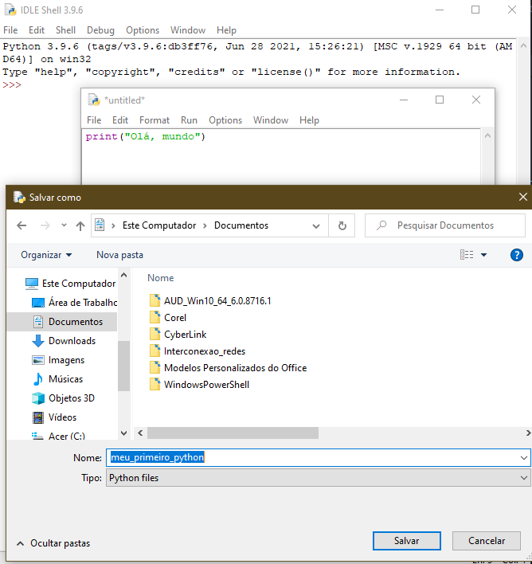

## 1.2.1.1 Comece a sua viagem em Python

### Como obter o Python e como conseguir utilizá-lo

Existem várias maneiras de obter o Python3 isso dependerá do sistema operacional que está sendo utilizado.

- **Linux**: Em muitas versões o Pyhton3 já vem instalado já que a infraestrutura do Python é intensamente utilizada por muitos componentes do sistema operativo Linux.
  
Caso o Python 3 ainda não esteja instalado é possível realizar esse procedimento através do terminal a partir do comando:`python3` seguindo de enter.

O resultado será uma mensagem do tipo:


```python
Python 3.4.5 (default, Jan 12 2017, 02:28:40)
[GCC 4.2.1 Compatible Clang 3.7.1 (tags/RELEASE_371/final)] on linux
Type "help", "copyright", "credits" or "license" for more information.
```


- **Outros sistemas operacionais**: O python3 pode ser instalado através do link `https://www.python.org/downloads/`.


  Após entrar no link acima, o próprio browser identificará o sistema operacional que está sendo utilizado e automaticamente direcionará para o software indicado para download.
  
    - Windows: arquivo.exe
    - MacOs: arquivo.pkg

### Iniciando o seu trabalho com Python

Existem muitas formas de utilizar o Python.
Para começar os trabalho você precisará das seguintes ferramentas:

- Um editor que te permitirá realizar a escrita dos códigos em Python.
- Um terminal/consola para poder testar o código escrito.
- Uma ferramenta chamada debugger, que permitirá a inspeção do código em cada momento de sua execução.

A instalação do Python3 contém uma aplicação chamada IDLE (*Integrated Development and Learning Environment*).

>**Vídeos interessantes**:
>
> [Instalação do Python3 no Windows](https://python.org.br/instalacao-windows/)
> [Instalando o Python3](https://www.youtube.com/watch?v=VuKvR1J2LQE)
> [Utilizando o IDLE no Windows](https://www.youtube.com/watch?v=31llNGKWDdo&list=PLvE-ZAFRgX8hnECDn1v9HNTI71veL3oW0&index=5)

### Como escrever e executar o seu primeiro programa

Para criar seu primeiro programa siga as instruções abaixo:

1. Abra o **IDLE**
2. Crie seu primeiro ***source file*** e escreva seu código.
  2.1 Clique em *File* no menu do IDLE
  2.2 Escolha *New File*
  
  
3. A janela do Editor será aberta, nela o *source code* será tratado
   

4. Nomei o *source file* (janela do editor)
5. Clique em *File* 
6. Clique em *Save as...*
7. Escolha uma pasta para salvar e o nome do ficheiro também
8. Agora escreva na janela recém aberta a frase `print("Olá, mundo!")`
  

  8.1 Salve
   

  8.2 Rode o arquivo selecionando a opção **Run**

  
``

Se o código não tiver erros irá ser executado na janela principal.

Feche o IDLE e inicie novamente.

### Como estragar e corrigir seu código

Agora procure no computador o local aonde você havia salvado o ficheiro. Abra-o novamente e o execute.

Perceba que ele foi recuperado e executado sem nenhuma dificuldade. 

Agora iremos estragar ele um pouco....(risos), para isso siga os passos abaixo:

- Elimine o parênteses final e salve o código
- Agora tente executar

O IDLE mostrará um erro e não executará o código, corrija colocando novamente o parênteses no final e salve o arquivo.

O IDLE mostrará um erro diferente para cada tipo de erro. Por exemplo, agora tente executar (Run) o código novamente, mas antes retire a letra "t" do final da palavra "print".

Observe que o erro é diferente, a natureza do erro pode ser observada na janela da consola.

## Fim do Módulo 1! :clap::clap:

Muito bem! Chegou ao fim do Módulo 1 e completou um marco importante na sua educação em programação Python. Aqui está um breve resumo dos objetivos que abordou e com os quais se familiarizou no Módulo 1:

- os fundamentos da programação informática, ou seja, como o computador funciona, como o programa é executado, como a linguagem de programação é definida e construída;
- A diferença entre compilação e interpretação;
- a informação básica sobre Python e como se posiciona entre outras linguagens de programação, e o que distingue as suas diferentes versões;
-  recursos de estudo e os diferentes tipos de interfaces que irá utilizar no curso.

>***Fonte**: Curso Python Essentials oferecido pela Python Institute*

