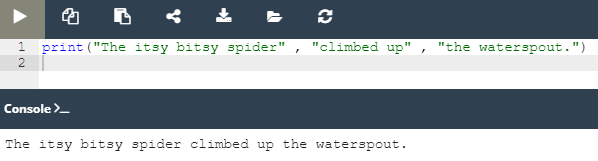
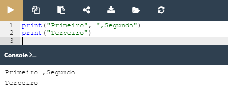

## 2.1.1.1 O seu primeiro programa

### Conhecendo a função print!

A partir de agora iremos nos ocupar em entender todos os elementos presentes na linha de código abaixo:

`print("Hello, world!")`

Escrito acima, observamos os seguintes elementos:

- a palavra `print`
- parênteses de abertura e fechamento
- aspas antes e depois do texto
- uma linha de texto: Hello, World!

A palavra ***print*** é o nome de uma função.
O objetivo dessa função é imprimir/apresentar algo na tela/ecrã.

Nesse contexto, da programação, a função é uma parte separada do código do computador capaz de:
  
- **causar um efeito** como, enviar texto para o terminal, criar um ficheiro, desenhar uma imagem..etc;
- **avaliar um valor** e **devolvê-lo** como o resultado da função;

Muitas das funções em Python podem fazer as duas coisas citadas acima de forma conjunta.Além disso, as funções podem ter:

- um efeito
- um resultado
- um argumento

De onde vêm as funções?

- Podem vir do próprio Python, chamamos essas funções de incorporadas, assim como a função *print*
- Podem ser provenientes de um ou mais add-ons de Python, chamados de módulos; Alguns desses módulos vem com o Python e outros precisam ser adicionados;
- Podem ser escritos pelo próprio usuário(programador).

O **nome das funções** precisam ser siguinificativos.

Acima apontei que a função pode ter um resultado e um efeito, assim como também um argumento.O que seria esse argumento?

Assim como na matemática, onde o sex(x) toma um x que é a médida de um ângulo, na programação para algumas situações as funções pedem argumentos. Elas podem aceitar qualquer número de argumentos, tantos quantos forem necessários. Outras funções não necessitam do uso de argumentos.

Note que, similarmente com na matemática os argumentos passados para a função na programação exigem fortemente a presença de um par de parenteses `()` . Mesmo que não sejam passados argumentos para a função, o uso dos parênteses é obrigatório.

>**Note:** Para distinguir nomes comuns de nomes de função, coloque um parenteses apos o nome. Aplicando a função que estamos conhecendo é a função `print()`.

No caso da função `print()`, o argumento passado foi a sequência de caracteres `Hello, World!`.
Observando o exemplo passado (`print("Hello, world!")`) é fácil notar que a string de caracteres é delimitada por aspas duplas `""` . A utilização das aspas cortam uma parte do código e lhe atribuem um siguinificado diferente o de **string**.

Quase tudo passado entre aspas será tomado como literal, como dados. No exemplo inicial, podemos mudar essa cadeia de caracteres, imprimindo novos dados na tela (como exemplo, `print("Hello, meu nome é Bob Esponja!")`).

Quando desejamos invocar uma função utilizamos o nome da função seguindo de parenteses, dessa forma:
`print()`.

Agora vamos entender um pouquinho de como a leitura do código é feita pelo Python e o porque que reconhecer os elementos e entender seus devidos papeis é importante para a escrita de um código correto.

O que você acha que acontece quando o Python encontra uma invocação escrita da seguinte forma:

`function_name(argument)`

  1. O Python verifica se o nome especificado é **legal**(se realmente compõe sua biblioteca de funções interna), caso a pesquisa falhe ele abortará o código;
  2. O Python verifica se os requisitos da função para o número de argumentos **lhe permite invocar** a função desta forma (caso a função necessite de dois argumentos, mas só foi passado um a invocação será considerada errada e o código será abortado)
  3. O Python deixa o seu código por um momento e salta para a função que deseja invocar juntamente com seus argumentos e passa-os para a função;
  4. A função **executa o seu código**, avalia o efeito causado pelo resultado e termina sua tarefa;
  5. O Python **regressa ao seu código**(imediatamente após a invocação) e retoma a sua função.

#### Entendendo a função Print()

1. Qual é o efeito que a função `print()` causa?
    - toma os seus argumentos(pode aceitar mais que um argumento e menos que um)
    - converte-os numa forma legível para o ser humano
    - envia os dados resultantes para o dispositivo de output(consola/terminal).
     
Sendo assim, tudo passado para a função **print()** será impresso no ecrã.

2. Que argumentos o `print()` espera?
Qualquer um, esas função é capaz de operar virtualmente todos os tipos de daos oferecidos pelo Python, sejam *strings, número, caracteres, valores lógicos, objetos*, qualquer um pode ser passado com o argumento para essa função.
Caso usemos a função `print()` dessa maneira, sem argumentos, será impressa uma linha em branco na consola.

*Função print() com e sem argumentos*

3. Qual o valor devolvido pela função?
Nenhum, seu efeito é suficiente.

*Visão detalhada das partes da função print()*

#### O carater de escape (\ ) e newline (n)

Existem alguns caracteres que desempenham papeis interessantes e que podem vir a ser bastante úteis.

*Função print() e os caracteres de escape e new line*

Observe o código acima, é possível observar que existe uma `\` conhecido como barra invertida e após ela existe a letra ``n`.

Nesse contexto a `\` é usada para avisar que uma série de caracteres vão escapar por um momento, ela anuncia esse comportamento.
A letra `n` colocada ápos a `\` vem da palavra ***newline***(nova linha). A junção desses dois símbolos formar o símbolo especial chamado de **caracter de newline** que incita a consola a iniciar uma nova **linha de output**.

Até agora utilizamos a função **print()** com e sem argumentos, nesse momentos passaremos a testá-lá com múltiplos argumentos.

### Função print() e múltiplos argumentos

A função **print()** pode receber múltiplos argumentos, para utilizarmos de maneira correta é necessário separá-los por virgulas e se forem strings devem ser seguidos de `""` como mostra o exemplo abaixo:

*Função print() utilizando três argumentos separados por vírgulas e aspas duplas*

A função **print()** acima recebeu três parametros, onde todos são strings.
Observe que o **papel desempenhado pela vírgula** nessa situação é completamente diferente dos outros que já vimos,onde a vírgula aparecia dentro da string, nesse caso a vírgula é utilizada como **parte da sintaxe do Python**.

*Função print() utilizando três argumentos distintos*

Observe que nesse novo exemplo, acima, de uma forma geral tudo que está dentro das aspas duplas é impresso na consola, tanto o **>** como as **,** podem ser vistos sendo impressos.
Observe também que o número **5** não foi colocado entre **""** e mesmo assim ele foi impresso sem problemas.

### Função print() - forma de repassar os argumentos

 - Forma Posicional:
  
A forma que estamos passando para repassar os argumentos é chamada de **forma posicional** uma vez que, o segundo argumento passado vem depois do primeiro, o terceiro depois do segundo e assim sucessivamente.

*Função print() recebendo os parametros na forma posicional*

Existe um mecanismo, conhecido como **argumentos de keyword**, que permite retirar os argumentos não da sua localização ou posição e sim da palavra especial(keyword) utilizada para os identificar.

A função `print()` possue dois mecanismos de keyword que pode ser utilizado. 
   - Argumentos de Keyword:
     - O primeiro é o ***end***

*Argumento de keyword - end*

Para que possamos utilizar corretamente esse mecanismo precisamos conhecer algumas regras:
1. um argumento de keyword consiste em três elementos: uma **keyword**(palavra chave) identificado o argumento (`end`); um **sinal** de igual (`=`); e um **valor** atribuído a esse argumento.
2. qualquer argumento de keyword tem de ser colocado após o último argumento posicional.

>***Fonte**: Curso Python Essentials oferecido pela Python Institute*