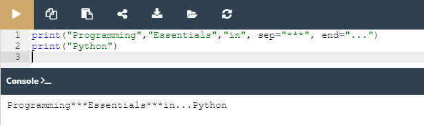

## 2.1.1.18 LAB: Função print()

#### Objetivo

 - familiarizar-se com a função `print()` e as suas capacidades de formatação;
 - experimentar com código Python.

#### Cenário

Modifique a primeira linha de código no editor, usando as keywords `sep` e `end` , para corresponder ao output esperado. Use as duas `print()` funções no editor.

Não mude nada na segunda invocação `print()` .

#### Output esperado

`Programming***Essentials***in...Python`

####  Resultado

*Resultado do laboratório da função print()*

>***Fonte**: Curso Python Essentials oferecido pela Python Institute*