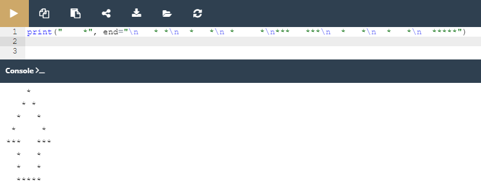
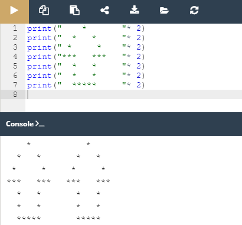

## 2.1.1.19 LAB: Função print()

#### Objetivo

 - experimentar com o código Python existente;
 - descobrir e corrigir erros básicos de sintaxe;
 - familiarizar-se com a função `print()` e os seus recursos de formatação

#### Cenário

Encorajamo-lo vivamente a **brincar com o código** que escrevemos para si, e a fazer algumas (talvez mesmo destrutivas) alterações. Sinta-se livre para modificar qualquer parte do código, mas há uma condição - aprenda com os seus erros e tire as suas próprias conclusões.

Não mude nada na segunda invocação `print()` .

#### Tente

 - minimizar o número de invocações da função print() inserindo a sequência \n nas strings
 - fazer a seta duas vezes maior (mas mantendo as proporções)
 - duplicar a seta, colocando ambas as setas lado a lado; nota: uma string pode ser multiplicada usando o seguinte truque: "string" * 2 produzirá "stringstring" (brevemente, falaremos mais sobre o assunto)
 - retire qualquer uma das aspas, e veja cuidadosamente a resposta do Python; preste atenção ao local onde o Python vê um erro - é este o local onde o erro realmente existe?
 - faça o mesmo com alguns dos parêntesis;
 - altere qualquer uma das print palavras por outra coisa, diferindo apenas no caso (por exemplo, Print) - o que acontece agora?
 - substitua algumas das aspas por apóstrofes; observe cuidadosamente o que acontece.

####  Resultado

*Criando uma seta com menor número de prints*

*Duplicando a seta*

> Note: Os códigos dos laboratórios encontram-se na pasta **Scripts**

>***Fonte**: Curso Python Essentials oferecido pela Python Institute*