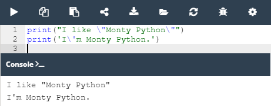
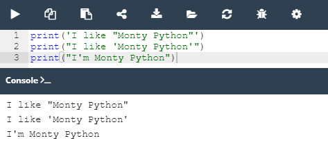

## 2.2.1.1 Literais no Python

### Literais - os dados em si

Agora precisamos aprender o que é o **literal**.

Um literal são dados cujos valores são determinados pelo próprio literal.

Vamos partir para os exemplos para ficar mais fácil de entender.

 1. Exemplo 1: ``123``
 2. Exemplo 2: `c`
   

**Observando os exemplos acima para quais deles você consegue determinar o valor?** 

Com certeza a sua reposta foi para o **primeiro**, seu valor é igual a ``cento e vinte e três``, nesse caso o consideramos como literal.

No **segundo** exemplo **não conseguimos determinar** o valor de `c`. Pode ser o símbolo da velocidade da luz, da temperatura(Celsius) é necessário ter um conhecimento adicional para o determinar de forma correta.

Utiliza-se **literais para codificar dados e para os colocar no seu código**.
Abaixo seguem algumas convenções que devem ser obedecidas quando utilizamos Python.

Agora faremos um experimento!


*Exemplo dois tipos de literais*

Observe o código acima. Nele existem dois exemplos utilizando a ``função print()``:
 - uma **string**
 - um **número inteiro**

Apesar da impressão desse números na consola serem iguais, o armazenamento dos mesmos na mémoria do computador e completamente diferente.

A **string** é armazenada como uma série de letras.
O **número** é convertido em representação mecânica(conjunto de bits). A função ``print()`` é capaz de monstrar ambos em uma forma legível para os seres humanos.

**Então qual é a difenrença interna?**

### Inteiros

Os computadores utilizam o **sistema binário** para armazenas e realizar operações sobre números. Os computadores modernos tratam os números como **dois tipos**:

 - **Inteiros**: Aqueles que são desprovidos da parte draccionada;
 - ***Floating-point ou float*** (ponto flutuante): Aqueles que contém ou são capazes de conter a parte fraccionada.

A distinção entre esses dois números é de grande importância pois isso influência diretamente a **forma que ambos são armazenados na mémoria e no interválo de valores aceitáveis**.

O Python reconhece os inteiros como uma string de dígitos e entre eles não deve haver quaisquer caracteres que não sejam dígitos dentro do número.

A representação do número **11.111.111** (onze milhões centro e onze mil e cento e onze)
pode ser feita de duas maneiras: ``11111111``, ou ``11_111_111`` com *undescore*.

Os números negativos são codificados, como de costume, adicionando um menos antes deles. Podemos escrever : ``-11111111``, ou ``-11_111_111``

>**Nota**: Python 3.6 introduziu underscores em letras numéricas, permitindo a colocação de underscores únicos entre dígitos e após especificadores de base para melhorar a legibilidade. Este recurso não está disponível em versões mais antigas de Python.


### Inteiros: números octais e hexadecimais

No Python podemos usar duas convenções adicionais, para representação [octal](https://pt.wikipedia.org/wiki/Sistema_octal) e [hexadecimal](https://pt.wikipedia.org/wiki/Sistema_de_numera%C3%A7%C3%A3o_hexadecimal).

 - **Representação octal**: coloca-se o número precedido por um `0o` ou `0O`(zero-o). O número será tratado como um valor octal, ou seja, um número contendo digitos retirados do intervalo [0...7]. A classe `print()` faz essa conversão automaticamente.
  
O número `0o123` é um número **octal** com valor(decimal) igual a `83`: `print(0o123)` sua impressão é = `83`
 - **Representação Hexadecimal**: coloca-se o número precedido pelo prefixo `0x` ou `0X `(zero-x). 

O número `0x123` é um número **hexadecimal** com um valor(decimal) igual a `291`:`print(0x123)`sua impressão é = `291`


### Floats

O tipo **float** foi criado para representar e armazenar os números que têm uma **fração decimal não vazia**. Esse são números que tem ou podem ter uma parte fracionada após o ponto decimal.

Sempre que pensamos em números com a estrutura semelhante a`` dois e meio``(2.5) ou ``menos zero ponto quatro``(-0.4), estamos falando de números do tipo float/floating-point ou ponto flutuante.

Apesar de estarmos acostumados a fazer a representação desses número utilizando uma vírgula, devems nos certificar que aqui eles serão representados **utilizando ponto**, uma vez que a vírgula possui um siguinigificado próprio no Python. Utilizá-lá para fazer a representação de números flutuantes pode vir a ocasionar problemas de leitura e interpretação pela linguagem.

>Nota: No Python podemos omitir o valor do zero quando é o único digito em frente ou após o ponto decimal, dessa forma podemos escrever zero ponto quatro de duas maneiras: **`0.4` ou `.4`** e o valor quatro também pode ser escrito de duas formas: **`4.0` ou `4.`**


### Ints vs. Floats

A utilização do ponto na representação de números de ponto flutuante é extritamente necessária, uma vez que esse recurso permite que o Python diferencie representações como as indicadas abaixo:


```python
4 #número inteito
4.0 #número de ponto flutuante
```
O ponto é o responsável por fazer o floating-point.
Na representação de números muito grandes ou muito pequenos, pode-se optar pela utilização da notação científica.

A velocidade da luz,expressa em mêtros por segundo, por exempo, é expressa como: ``300000000`` sua representação pode ser feita da seguinte maneira `3x10`<sup>`8`.Essa representação em Python é um pouco diferente:`3E8`.

>Nota: A letra E também pode ser escrita na forma minuscula (e) e vem da palavra **expoente**.

>Nota:
>- O expoente(valor após o E) deve ser um número inteiro.
>- a base (o valor à frente do E) pode ser um inteiro.

### Codificação de floats

Vejamos como essa convenção é utilizada para registrar números que são muito pequenos.
Observe como seria a representação da ***constante de Planck (6.62607 x 10-34)*** no Python: `6.62607E-34`. 

Por vezes, o Python pode escolher uma **notação diferente** para representação.
Por exemplo, digamos que você decidiu usar o segunte float literal:

`0.0000000000000000000001`, executando através do Python `print(0.0000000000000000000001)` o resultado seria esse:

```python
1e-22
```
Sempre ele **escolherá a forma mais econômica de apresentar o números**, devemos ter isso em mente ao criar literais.

### Strings

As strings são empregadas quando é necessário processar texto, não números.
Já sabemos que para identificar as strings precisamos de aspas, representando da seguinte maneira: `"I am a string"`.

Agora imagine a seguinte situação: Você deseja escreve um texto com aspas,como esse: `I like "Monty Python"`.Como você irá diferenciar essas aspas das aspas que caracterizam a string?

Para realizar esse feito, podemos seguir duas situações possíveis:

- **Caracter de escape**: A barra invertida (``\``) pode ser usada para escapar as aspas. Dessa forma uma aspa precedida por uma bara invertida muda o seu siguinificado - não é um delimitador, mas uma aspa.



*Impressão das aspas dentro de uma string - Solução 1*

- **Apostrofe em vez de uma aspas**: O python pode utilizar o apostrofé``(')`` no lugar das aspas. Porém seu uso precisa ser consistente. Se a delimitação da string for feita com apostrófe no início, o final também precisa seguir esse padrão, como no exemplo abaixo:



*Impressão das aspas dentro de uma string - Solução 2* 


>***Fonte**: Curso Python Essentials oferecido pela Python Institute*