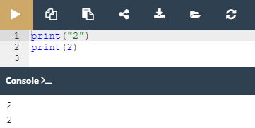

## 2.2.1.1 Literais no Python

### Literias - os dados em si

Agora precisamos aprender o que é o **literal**.

Um literal são dados cujos valores são determinados pelo próprio literal.

Vamos partir para os exemplos para ficar mais fácil de entender.

 1. Exemplo 1: ``123``
 2. Exemplo 2: `c`
   

**Observando os exemplos acima para quais deles você consegue determinar o valor?** 

Com certeza a sua reposta foi para o **primeiro**, seu valor é igual a ``cento e vinte e três``, nesse caso o consideramos como literal.

No **segundo** exemplo **não conseguimos determinar** o valor de `c`. Pode ser o símbolo da velocidade da luz, da temperatura(Celsius) é necessário ter um conhecimento adicional para o determinar de forma correta.

Utiliza-se **literais para codificar dados e para os colocar no seu código**.
Abaixo seguem algumas convenções que devem ser obedecidas quando utilizamos Python.

Agora faremos um experimento!

*Exemplo dois tipos de literais*

Observe o código acima. Nele existem dois exemplos utilizando a ``função print()``:
 - uma **string**
 - um **número inteiro**

Apesar da impressão desse números na consola serem iguais, o armazenamento dos mesmos na mémoria do computador e completamente diferente.

A **string** é armazenada como uma série de letras.
O **número** é convertido em representação mecânica(conjunto de bits). A função ``print()`` é capaz de monstrar ambos em uma forma legível para os seres humanos.

**Então qual é a difenrença interna?**

### Inteiros

Os computadores utilizam o **sistema binário** para armazenas e realizar operações sobre números. Os computadores modernos tratam os números como **dois tipos**:

 - **Inteiros**: Aqueles que são desprovidos da parte draccionada;
 - ***Floating-point ou float*** (ponto flutuante): Aqueles que contém ou são capazes de conter a parte fraccionada.

A distinção entre esses dois números é de grande importância pois isso influência diretamente a **forma que ambos são armazenados na mémoria e no interválo de valores aceitáveis**.

O Python reconhece os inteiros como uma string de dígitos e entre eles não deve haver quaisquer caracteres que não sejam dígitos dentro do número.

A representação do número **11.111.111** (onze milhões centro e onze mil e cento e onze)
pode ser feita de duas maneiras: ``11111111``, ou ``11_111_111`` com *undescore*.

Os números negativos são codificados, como de costume, adicionando um menos antes deles. Podemos escrever : ``-11111111``, ou ``-11_111_111``

>**Nota**: Python 3.6 introduziu underscores em letras numéricas, permitindo a colocação de underscores únicos entre dígitos e após especificadores de base para melhorar a legibilidade. Este recurso não está disponível em versões mais antigas de Python.

### Inteiros: números octais e hexadecimais

No Python podemos usar duas convenções adicionais, para representação [octal](https://pt.wikipedia.org/wiki/Sistema_octal) e [hexadecimal](https://pt.wikipedia.org/wiki/Sistema_de_numera%C3%A7%C3%A3o_hexadecimal).

 - **Representação octal**: coloca-se o número precedido por um `0o` ou `0O`(zero-o). O número será tratado como um valor octal, ou seja, um número contendo digitos retirados do intervalo [0...7]. A classe `print()` faz essa conversão automaticamente.
  
O número `0o123` é um número **octal** com valor(decimal) igual a `83`: `print(0o123)` sua impressão é = `83`
 - **Representação Hexadecimal**: coloca-se o número precedido pelo prefixo `0x` ou `0X `(zero-x). 

O número `0x123` é um número **hexadecimal** com um valor(decimal) igual a `291`:`print(0x123)`sua impressão é = `291`

### Floats

>***Fonte**: Curso Python Essentials oferecido pela Python Institute*