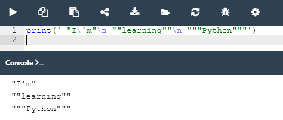

## 2.2.1.11 Lab: Literais de Python - Strings

#### Objetivo

 - familiarizar-se com a função `print()` e as suas capacidades de formatação;
 - experimentar com código Python.
 - praticar codificação de strings


#### Cenário

Escreva um código de uma linha, utilizando a função ``print()`` , bem como os carateres de newline e de escape, para corresponder ao resultado esperado emitido em três linhas.

#### Output esperado

```
"I'm"
""learning""
"""Python"""
```

####  Resultado

Para realizar esse desafio eu segui o caminho mais fácil, usei a barra invertida (``\``) para pode representar o apostrofo. Para pular a linha usei o `\n`e para representar as aspas duplas coloquei toda a frase dentro dos apostrofos(`'`).




*Lab: Lietarias de Python - Strings*

>***Fonte**: Curso Python Essentials oferecido pela Python Institute*