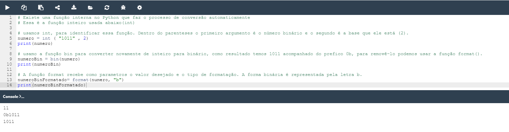

## 2.2.1.12 Resumo da Secção

### Key takeaways

1. Os **literais** são notações para representar alguns valores fixos em código. O Python tem vários tipos de literais - por exemplo, um literal pode ser um número (literais numéricos, por exemplo, ``123``), ou uma string (literais de string, por exemplo, **“Eu sou um literal."**).

2. ``O sistema binário`` é um sistema de números que emprega *2* como base. Portanto, um número binário é composto apenas por 0s e 1s, por exemplo, ``1010`` é *10* em decimal.

Os sistemas de numeração octal e hexadecimal, do mesmo modo, empregam *8 e 16* como suas bases, respetivamente. O sistema hexadecimal utiliza os números decimais e seis letras extra.

3. **Inteiros** (ou simplesmente **ints**) são um dos tipos numéricos suportados pelo Python. São números escritos sem um componente fracionário, por exemplo, ``256``, ou ``-1`` (inteiros negativos).

4. Números de **floating-point** (ou simplesmente **floats**) são outro dos tipos numéricos suportados pelo Python. São números que contêm (ou são capazes de conter) um componente fracionário, por exemplo ``1.27``.

5. Para codificar uma apóstrofe ou uma aspa dentro de uma string, pode usar o caratere de escape, por exemplo, `'I\'m happy.'`, ou abrir e fechar a string utilizando um conjunto de símbolos opostos aos que deseja codificar, por exemplo ``"I'm happy."`` codificar uma apóstrofe, e ``'He said "Python", not "typhoon"'`` para codificar umas aspas (duplas).

6. Valores booleanos são os dois objetos constantes ``True`` e ``False`` usado para representar valores de verdade (em contextos numéricos ``1`` é ``True``, enquanto ``0`` é ``False``.

>**Note:** Há mais um literal especial que é usado em Python: o literal *``None``* . Este literal é um ...chamado *``NoneType``* objeto, e é utilizado para representar **a ausência de um valor**. Em breve, contar-lhe-emos mais sobre isso.

### Exercício 1

Que tipos de literais são os dois exemplos seguintes?

1. `"Hello ", "007"` São strings, observe as ``aspas duplas``.
2. ``"1.5", 2.0, 528, False`` O primeiro é string; o segundo float; o terceiro inteiro e o último booleano.

### Exercício 2

Qual é o valor decimal do número binário abaixo?

``1011``

*Lab: Lietarias de Python - Conversão de valores*

>**Note:** No exercício 2 utilizei uma função que ainda não foi vista aqui para realizar a conversão de inteiro para binário e de binário para inteiro, assim como também utilizei a função format() para realizar a formatação da saída.

>***Fonte**: Curso Python Essentials oferecido pela Python Institute*