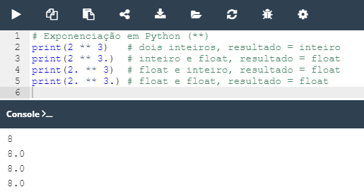
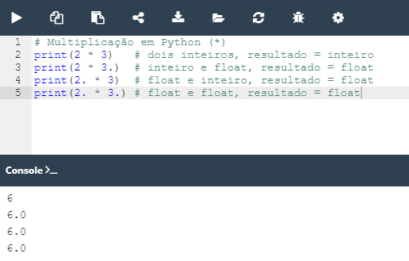
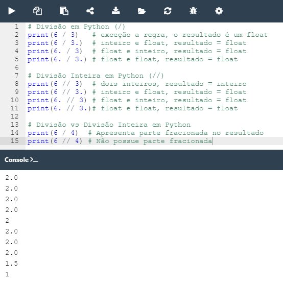
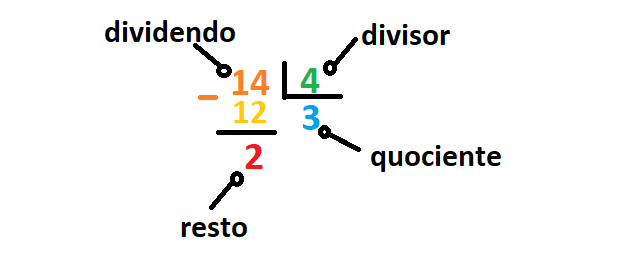
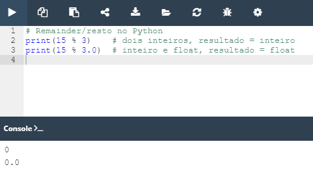

## 2.3.1.1 Operadores - ferramentas de manipulação de dados

### Operadores Básicos

Um operador é um símbolo da linguagem de programação capaz de operar sobre os valores.
Os **símbolos na programação são bem semelhantes aos da aritmética**, porém nem todos não são tão óbvios.

Falaremos sobre os mais utilizados nos próximos tópicos.

Para entender melhor esse tópico é interessante saber da ***regra dos Inteiros vs Float***.

De uma maneira geral, essa regra dita que o **resultado das operações entre um número inteiro vs um número float**, será um **número float**.

> **Fique atento** pois nem todas as operações citadas abaixo seguem a regra.

### Operadores: Adição (+)

O operador da adição, no Python, é o mesmo já conhecido da aritmética, o sinal de mais (``+``).

O resultado dessa operação também não apresenta nada de novo, observe: 


```python
print(-4 + 4)
print(-4. + 8)

#resultado
0
4.0
```

#### Operadores: Subtração (-)

Assim como o operador da adição o da subtração não esconde surpresas. 
Ele é representado pelo sinal de menos (``-``) e também apresenta uma semelhança com seu comportamento na mátematica que precisa ser explorada aqui.

Lembra daquela história, **menos com menos da mais e mais com menos da menos**? Poís é, aqui chamaremos esse hino de operadores unários e binários. E o que são eles na verdade?

- **Operadores unários** : São operadores que desempenham ação em um único operando.
- **Operadores binários** : São operadores que necessitam de dois operandos para desenvolver seu papel.

Os operadores de **subtração, adição, multiplicação e divisão são considerados binários**.

Quando realizamos uma subtração, esperamos que exista o termo da esquerda(**o minuendo**) e o da direita(**o subtraendo**). Isso ocorre pois o sinal de menos desempenha seu papel sobre os dois termos.

Porém o operador de menos e de mais também são considerados como **operadores unários**, observe o exemplo abaixo:


```python
print(-4 - 4)
print(4. - 8)
print(-1.1)

# resultado
-8
-4.0
-1.1
```
Nos exemplos acima, o operador preservou o sinal de seu único argumento - o correto.


### Operadores Aritméticos: Exponenciação (**)

A exponenciação(potência) é representada pelo sinal ``**`` (duplo asterisco).
Na matemática essa operação é comumente expressa da seguinte maneira: **2<sup>4**, onde o argumento a esquerda é a **base** e o da direita, o **expoente**.

No Python essa representação deve ser realizada seguindo o exemplo, `2 ** 4` ou ``2**4``.

>**Lembre-se:** 
>- quando ambos os argumentos são inteiros, o resultado é também um inteiro;
>- quando pelo menos um argumento é um float, o resultado é também um float;



*Exemplos de exponenciação e o seu comportamento na regra dos inteiros vs float*


### Operadores Aritméticos: Multiplicação (*)

O operador da multiplicação é o asterisco``(*)``.

No Python essa representação deve ser realizada seguindo o exemplo, `2 * 4` ou ``2*4``.



*Exemplos da multiplicação e o seu comportamento na regra dos inteiros vs float*

### Operadores Aritméticos: Divisão (/)

A divisão é representada por uma barra **(/)**.
O valor em frente a barra, ou seja, a direita da barra é o dividendo e o valor a esquerda é o divisor.

No Python a divisão é representada da seguinte forma: ``6 / 3`` ou ``6/3`` (*lê-se: seis dividido por três*).

> Nesse caso específico o resultado obtido pela divisão sempre será um float, ou seja, é uma exceção a regra dos **Inteiros vs Float**.


### Operadores Aritméticos: Divisão Inteira (//) ou *Floor Divison*

A divisão inteira é representada pela dupla barra (``//``).Sua representação em Python seria, ``6 // 4`` ou ``6//4``. Ela também é conhecida com ***Floor Division***.

Essa divisão difere daque usamos ``/`` em dois sentidos:
- o seu resltado não tem a parte fracionada, está ausente para número inteiros ou é sempre zero para floats, isso implica no arredondamento dos resultados, sempre.
- está em conformidade com a regra *inteiro vs. float*.




*Exemplos das divisões e o seu comportamento na regra dos inteiros vs float*


Agora imagine que o cálculo que precisa ser realizado envolve valores negativos, como os exemplos abaixo:


```python
print(-6 // 4) 
print(6. // -4)

#resultado
-2
-2.0
```
O resultado são dois negativos.

**Porque os resultados deram negativos?**

O resultado real,ou seja, não arredondado é ``-1,5``, como o que teriamos caso usassemos a divisão com uma barra. No entando, os resultados usando a divisão inteira está sujeito a arredondamentos. 
**O arredondaento leva o resultado para o menor valor inteiro**, que nesse caso seria ``-2``, logo:``-2`` e ``-2.0`` .


### Operadores: remainder (modulo)

A representação gráfica do operador de remainder/modulo no Python é o sinal ``%``.
Para ajudar a imaginação, tente pensar nesse sinal como a barra da divisão acompanhada por pequenos círculos engraçados.

O resultado apresentado por esse operador é o **remainder(resto) deixado após a divisão inteira**, ou seja, é o valor que sobrou depois de dividir um valor pelo outro.

Vamos observar um exemplo para ficar mais claro sua aplicação.
Imagine que você deseja saber o resultado da divisão entre ``14 // 4``.

Podemos obter essa resposta, no Python, através da seguinte linha de comando:`print(14 % 4)`.
O resultado será = ``2``.

Vamos entender passo-a-passo de como funciona esse operador através do esquema e da imagem abaixo:

  1. A divisão inteira de ``14 // 4``  resulta em um quociente igual a ``3``;
  2. ``3*4`` da ``12``, como resultado da multiplicação de quociente e divisores;
  3. ``14-12`` da ``2`` que é o resto.




*Entendendo como funciona o operador remainder/resto*

Agora um exemplo com valores númericos do tipo float: 


```python
print(12 % 4.5)
# o resto é igual a 3.0. É um float pois o processo de divisão envolveu um número float.
3.0
```

Você entendeu o exemplo acima?

Os passos para entender essa divisão seriam esses:
  1. A divisão inteira de ``12 // 4.5``  resulta em um quociente igual a ``2``;
  2. ``2*4.5`` da ``9``, como resultado da multiplicação de quociente e divisores;
  3. ``12-9`` da ``3.0`` que é o resto.



*Exemplos utilizando o operador Remainder (resto)*


>**Nota:** O uso dos espaços entre os simbolos e os números melhoraram a legibilidade do código, porém não são obrigatórios.

### Principais operadores e operações realizadas no Python
|Operador   |Operação  |
|:---------:|:---------:|
|    +      | Adição    | 
|    -      | Subtração | 
|    *      | Multiplicação 
|    **     | Exponenciação |   
|    /      | Divisão   | 
|    //     | Divisão inteira |  
|    %      | Remainder/resto ou módulo |     


>**Lembre-se:** Os dados e os operadores, quando interligados, formam expressões. A expressão mais simples é o próprio literal.

### Operadores e suas prioridades

Até esse momento, tratamos os operadores de forma independente, porém esse não é um cenário muito real na programação, uma vez que é muito comum utilizarmos mais de um operador por expressão.

Imagine a expressão: ``2 + 3 * 5``.

Provavelmente seu cerebro treinado, por anos ouvindo que multiplicação vem antes da adição, já deve ter organizado uma maneira de realizar essas operações.

Esse conceito se chama **Hierarquia de Propriedades**, ela dita que nessa situação devemos **primeiro multiplicar 3 por 5**, **armazenar o resultado**, ou seja, o valor de 15 na memória e na sequência **somar esse valor ao número 2**.

O Python define essas prioridades com precisão. Dessa forma ele já sabe que o ``*`` tem prioridade mais alta que o ``+`` e por isso o resultado deve ser óbvio.

### Operadores e suas prioridades


>***Fonte**: Curso Python Essentials oferecido pela Python Institute*