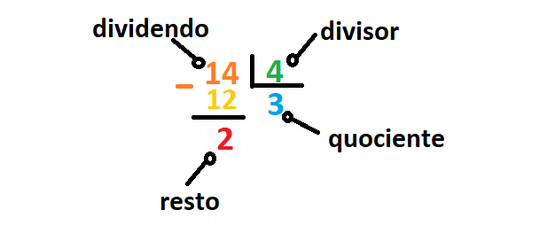

## 2.3.1.1 Operadores - ferramentas de manipulação de dados

### Operadores Básicos

Um operador é um símbolo da linguagem de programação capaz de operar sobre os valores.
Os **símbolos na programação são bem semelhantes aos da aritmética**, porém nem todos não são tão óbvios.

Falaremos sobre os mais utilizados nos próximos tópicos.

Para entender melhor esse tópico é interessante saber da regra dos ***Inteiros vs Float***.

De uma maneira geral, essa regra dita que o **resultado das operações entre um número inteiro vs um número float**, será um **número float**.

> **Fique atento** pois nem todas as operações citadas abaixo seguem a regra.

### Operadores Aritméticos: Exponenciação (**)

A exponenciação(potência) é representada pelo sinal ``**`` (duplo asterisco).
Na matemática essa operação é comumente expressa da seguinte maneira: **2<sup>4**, onde o argumento a esquerda é a **base** e o da direita, o **expoente**.

No Python essa representação deve ser realizada seguindo o exemplo, `2 ** 4` ou ``2**4``.


>**Lembre-se:** 
>- quando ambos os argumentos ``**`` são inteiros, o resultado é também um inteiro;
>- quando pelo menos um argumento ``**`` é um float, o resultado é também um float;

### Operadores Aritméticos: Multiplicação (*)

O operador da multiplicação é o asterisco``(*)``.

No Python essa representação deve ser realizada seguindo o exemplo, `2 * 4` ou ``2*4``.

### Operadores Aritméticos: Divisão (/)

A divisão é representada por uma barra **(/)**.
O valor em frente a barra, ou seja, a direita da barra é o dividendo e o valor a esquerda é o divisor.

No Python a divisão é representada da seguinte forma: ``6 / 3`` ou ``6/3`` (*lê-se: seis dividido por três*).

> Nesse caso específico o resultado obtido pela divisão sempre será um float, ou seja, é uma exceção a regra dos **Inteiros vs Float**.

### Operadores Aritméticos: Divisão Inteira (//) ou *Floor Divison*

A divisão inteira é representada pela dupla barra (``//``).Sua representação em Python seria, ``6 // 4`` ou ``6//4``. Ela também é conhecida com ***Floor Division***.

Essa divisão difere daque usamos ``/`` em dois sentidos:
- o seu resltado não tem a parte fracionada, está ausente para número inteiros ou é sempre zero para floats, isso implica no arredondamento dos resultados, sempre.
- está em conformidade com a regra *inteiro vs. float*.

Agora imagine que o cálculo que precisa ser realizado envolve valores negativos, como os exemplos abaixo:


```python
print(-6 // 4) 
print(6. // -4)

#resultado
-2
-2.0
```
O resultado são dois negativos.

**Porque os resultados deram negativos?**

O resultado real,ou seja, não arredondado é ``-1,5``, como o que teriamos caso usassemos a divisão com uma barra. No entando, os resultados usando a divisão inteira está sujeito a arredondamentos. 
**O arredondaento leva o resultado para o menor valor inteiro**, que nesse caso seria ``-2``, logo:``-2`` e ``-2.0`` .


### Operadores: remainder (modulo)

A representação gráfica do operador de remainder/modulo no Python é o sinal ``%``.
Para ajudar a imaginação, tente pensar nesse sinal como a barra da divisão acompanhada por pequenos círculos engraçados.

O resultado apresentado por esse operador é o **remainder(resto) deixado após a divisão inteira**, ou seja, é o valor que sobrou depois de dividir um valor pelo outro.

Vamos observar um exemplo para ficar mais claro sua aplicação.
Imagine que você deseja saber o resultado da divisão entre ``14 // 4``.

Podemos obter essa resposta, no Python, através da seguinte linha de comando:`print(14 % 4)`.
O resultado será = ``2``.

Vamos entender passo-a-passo de como funciona esse operador através do esquema e da imagem abaixo:

  1. A divisão inteira de ``14 // 4``  resulta em um quociente igual a ``3``;
  2. ``3*4`` da ``12``, como resultado da multiplicação de quociente e divisores;
  3. ``14-12`` da ``2`` que é o resto.




*Entendendo como funciona o operador remainder/resto*


>**Nota:** O uso dos espaços entre os simbolos e os números melhoraram a legibilidade do código, porém não são obrigatórios.

### Principais operadores e operações realizadas no Python
|Operador   |Operação  |
|:---------:|:---------:|
|    +      | Adição    | 
|    -      | Subtração | 
|    *      | Multiplicação 
|    **     | Exponenciação |   
|    /      | Divisão   | 
|    //     | Divisão inteira |  
|    %      | Remainder/resto ou módulo |     


>**Lembre-se:** Os dados e os operadores, quando interligados, formam expressões. A expressão mais simples é o próprio literal.


>***Fonte**: Curso Python Essentials oferecido pela Python Institute*