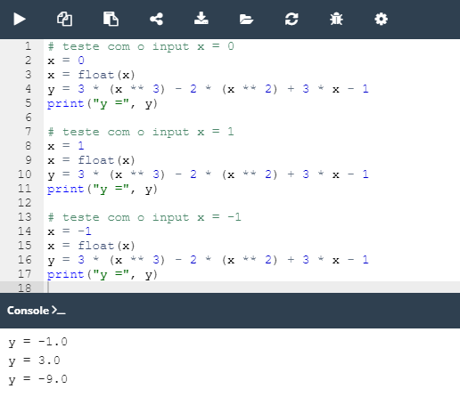

## 2.4.1.10 Lab: Operadores e Expressões

#### Objetivo

 - familiarizar-se com a função `print()` e as suas capacidades de formatação;
 - realizar cálculos e conversões básicos;

#### Cenário

Veja o código no editor: ele lê um valor ``float`` , coloca-o numa variável chamada ``x``, e imprime o valor de uma variável chamada ``y``. A sua tarefa é completar o código para avaliar a seguinte expressão:

**3x3 - 2x2 + 3x - 1**

O resultado deve ser atribuído a ``y``.

Lembre-se que a notação algébrica clássica gosta de omitir o operador de multiplicação - precisa de o utilizar explicitamente. Note como alteramos o tipo de dados para garantir que ``x`` é do tipo ``float``.

Mantenha o seu código limpo e legível, e teste-o usando os dados que fornecemos, atribuindo-o cada vez à variável ``x`` (por hardcoding). Não desanime por quaisquer falhas iniciais.

####  Resultado

**Códigos de teste:**

```python
x = 0
x = 1
x = -1

# Resultado esperado
y = -1.0
y = 3.0
y = -9.0
```

**Código fornecido:**

```python
x =  # hardcode your test data here
x = float(x)
# write your code here
print("y =", y)
```

**Resultado ápos as devidas modificações no código:**




*Lab: Operadores e Expressões*

>***Fonte**: Curso Python Essentials oferecido pela Python Institute*