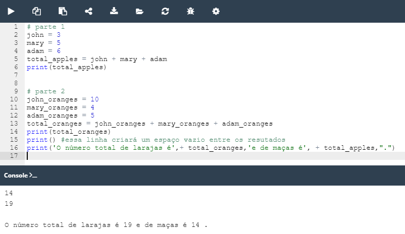

## 2.4.1.7 Lab: Variáveis

#### Objetivo

 - familiarizar-se com a função `print()` e as suas capacidades de formatação;
 - experimentar com código Python.
 

#### Cenário

Aqui está um conto:

Uma vez em Appleland, o John tinha três maçãs, a Mary tinha cinco maçãs, e o Adam tinha seis maçãs. Todos eles foram muito felizes e viveram durante muito tempo. Fim da história.

A sua tarefa é:

- criar as variáveis: ``john``, ``mary``, e ``adam``;
- atribuir valores às variáveis. Os valores devem ser iguais ao número de frutos possuídos pelo John, pela Mary e pelo Adam, respetivamente;
- tendo armazenado os números nas variáveis, imprimir as variáveis numa linha, e separar cada uma delas com uma vírgula;
- criar agora uma nova variável chamada ``total_apples`` igual à adição das três variáveis anteriores.
- imprimir o valor armazenado em ``total_apples`` para a consola;
- **experimente com o seu código**: crie novas variáveis, atribua-lhes valores diferentes e efetue várias operações aritméticas sobre elas (por exemplo, ``+``,`` -``, -, ``*``, ``/``, ``//``, etc.). Tente imprimir uma string e um inteiro juntos numa linha, por exemplo, ``"Total number of apples:" e total_apples``.

####  Resultado

*Lab: Variáveis no Python*

>***Fonte**: Curso Python Essentials oferecido pela Python Institute*