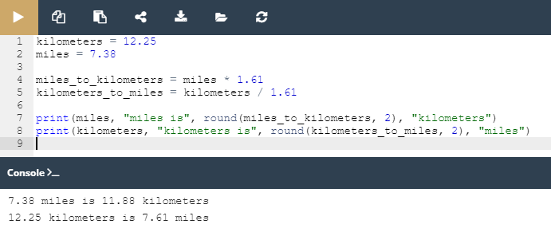

## 2.4.1.9 Lab: Variáveis - Conversor simples

#### Objetivo

 - familiarizar-se com a função `print()` e as suas capacidades de formatação;
 - experimentar com código Python.
 - realizar cálculos e conversões básicos;

#### Cenário

**Milhas e quilómetros são unidades de comprimento ou distância**.

Tendo em mente que ``1`` milha é aproximadamente igual a ``1.61`` quilómetros, complete o programa no editor para que ele converta:
 - milhas para quilómetros;
 - quilómetros para milhas.


Não altere nada no código existente. Escreva o seu código nos locais indicados por ``###``. Teste o seu programa com os dados que fornecemos no source code.

Preste especial atenção ao que está a acontecer dentro da função ``print()`` . Analise como fornecemos múltiplos argumentos à função, e como produzimos os dados esperados.

Note-se que alguns dos argumentos dentro da função ``print()`` são strings (por exemplo, ``"miles is"``, enquanto alguns outros são variáveis (por exemplo, ``miles``).


####  Resultado

Código fornecido:


```python
kilometers = 12.25
miles = 7.38

miles_to_kilometers = ###
kilometers_to_miles = ###

print(miles, "miles is", round(miles_to_kilometers, 2), "kilometers")
print(kilometers, "kilometers is", round(kilometers_to_miles, 2), "miles")
```

Resultado ápos as devidas modificações no código:



*Lab: Variáveis - Conversor simples*


> **Note:**
> Há mais uma coisa interessante a acontecer ali. Consegue ver outra função dentro da função print() ? É a função round() . O seu trabalho é o de arredondar o resultado em output para o número de casas decimais especificadas nos parêntesis, e devolver um float (dentro da round() função pode encontrar o nome da variável, uma vírgula, e o número de casas decimais que pretendemos). Vamos falar sobre funções muito em breve, por isso não se preocupe caso ainda não esteja tudo totalmente claro. Só queremos despertar a sua curiosidade.

> **Sugestão**
>Depois de concluir o lab, abra a Sandbox e experimente mais. Tente escrever conversores diferentes, por exemplo, um conversor de USD para EUR, um conversor de temperatura, etc. - deixe que a sua imaginação voe! Tente fazer output dos resultados combinando strings e variáveis. Tente usar e experimentar com a round() função para arredondar os seus resultados a uma, duas ou três casas decimais. Verifique o que acontece se não fornecer qualquer número de dígitos. Lembre-se de testar os seus programas.

**Experimente, tire conclusões, e aprenda. Seja curioso.** 


>***Fonte**: Curso Python Essentials oferecido pela Python Institute*