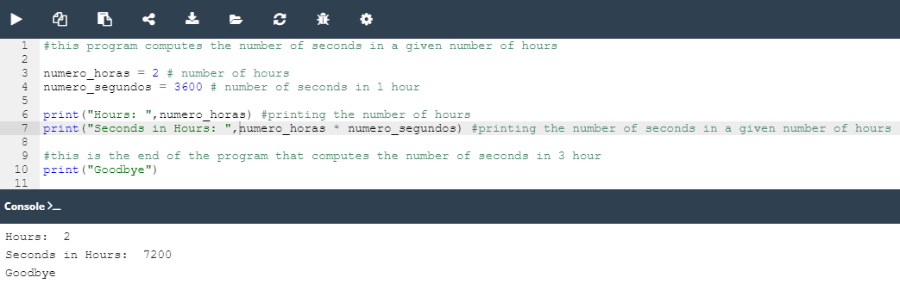

## 2.5.1.1 Lab: Comentários

#### Objetivo

 - familiarizar-se com a função `print()` e as suas capacidades de formatação;
 - experimentar com código Python;
 - usar e não usar comentários;
 - substituir comentários por código;

#### Cenário

O código no editor contém comentários. Tente melhorá-lo: adicione ou remova comentários onde achar apropriado (sim, por vezes remover um comentário pode tornar o código mais legível), e altere nomes de variáveis onde achar que isso irá melhorar a compreensão do código.

####  Resultado

**Código fornecido:**

```python
#this program computes the number of seconds in a given number of hours
# this program has been written two days ago

a = 2 # number of hours
seconds = 3600 # number of seconds in 1 hour

print("Hours: ", a) #printing the number of hours
# print("Seconds in Hours: ", a * seconds) # printing the number of seconds in a given number of hours

#here we should also print "Goodbye", but a programmer didn't have time to write any code
#this is the end of the program that computes the number of seconds in 3 hour
```

**Resultado ápos as devidas modificações no código:**




*Lab: Comentários*


>**Nota**:
>Os comentários são muito importantes. São utilizados não só para facilitar a compreensão dos seus programas, mas também para desativar as partes do código que atualmente não são necessárias (por exemplo, quando precisa de testar apenas algumas partes do seu código e ignorar outras). Bons programadores descrevem cada parte importante do código e dão nomes self-commenting às variáveis, já que por vezes é simplesmente muito melhor deixar informação no código.
>
>É bom usar nomes de variáveis legíveis, e por vezes é melhor dividir o seu código em partes nomeadas (por exemplo, funções). Em algumas situações, é uma boa ideia escrever os passos dos cálculos de uma forma mais clara.
>
>Mais uma coisa: pode acontecer que um comentário contenha uma informação errada ou incorreta - nunca se deve fazer isso de propósito!


>***Fonte**: Curso Python Essentials oferecido pela Python Institute*