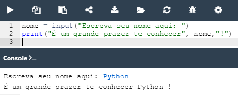
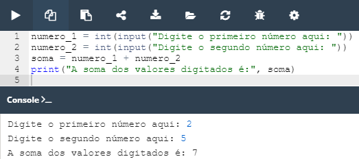

## 2.6.1.1 Como falar com o computador?

### A função input()

Já aprendemos, ao longo das últimas aulas, que a função ``print()`` envia dados para a consola.

A nova função que aprenderemos se chama ``input()``. Ela possibilita que o programa manipule dados, tornado-o mais interativo.
Virtualmente todos os programas lêem e processam dados.

A função ``input()`` permite a comunicação entre o usuário e o programa.

Imagine que você deseja escrever um programa que armazene o nome do usuário em uma variável e a imprima. Você poderia seguir o exemplo abaixo:


*Função input() - Exemplo 1: Digite seu nome*

A utilização da função ``input()`` é tão simples como observado no exemplo anterior.
 
Vamos entender **como a função input() funciona** passo-a-passo:

- **O programa pede ao utilizador que introduza alguns dados da consola** (muito provavelmente utilizando um teclado, embora também seja possível introduzir dados utilizando voz ou imagem);
- **a função ``input()`` é invocada sem argumentos** (esta é a forma mais simples de usar a função); a função irá mudar a consola para o modo de input; verá um cursor a piscar, e poderá introduzir algumas keystrokes, terminando com a tecla Enter; todos os dados introduzidos serão enviados para o seu programa através do resultado da função;
- **nota:** é necessário atribuir o resultado a uma variável; isto é crucial - a falta desta etapa fará com que os dados introduzidos se percam;
- então, **utilizamos a função ``print()`` para fazer output dos dados** que obtemos.

### A função input() com um argumento

Podemos utilizar a função ``input()`` suprimindo a ajuda do ``print()``, como mostra o exemplo abaixo:


*Função input() - Exemplo 2: Digite seu nome*

### O resultado da função input()

Para não restar dúvidas devemos ter em mente que **o resultado da função ``input()`` é sempre uma string**.

### A função input() - operações proibidas

**Agora imagine que** você está criando um programa que recebe dois valores inteiros apartir da inserção destes via teclado pelo usuário, para realizar uma soma dos mesmos. 
Nessa situação você utiliza a função ``input()`` normalmente, visando capturar os valores digitados. 

**Infelizmente quando você realizar a soma, ela não sairá como esperado** pois os números digitados estão sendo lidos como ``string``. Seria impossível realizar a soma de **duas strings**, nesse contexto o sinal de ``+`` funcionará como **concatenação** juntando os dois números, mas não somando-os, como mostrado abaixo:


*Função input() - Exemplo 3: Soma de dois valores com strings*

Assim como no exemplo da soma o mesmo irá acontecer com as outras operações matemáticas.

### Type casting

O **type casting** é nossa principal ferramenta para resolver problemas como esse.

O Python fornece duas funções simples para especificar um tipo de dados e resolver esse problema são elas, ``int()`` e ``float()``.

- **a função** ``int()`` converte um argumento tomado num inteiro;
- **a função** ``float()`` toma um argumento (por exemplo, uma string: float(string)) e tenta convertê-lo num float.

Observe o exemplo abaixo e veja como o problema apresentando na situação anterior pode ser solucionado utilizando o recurso da conversão dos tipos:


*Função input() - Exemplo 4: Soma de dois valores convertidos de string para inteiro*

### Mais sobre input() e type casting

O trio ``input()``, ``int()`` e ``float()`` abrem um leque de novas possibilidade.

Lembra daquele exemplo onde calculavamos o comprimento da hipotenusa? Vamos trabalhar novamente com ele, introduzindo agora esses novos participantes.

**Código escrito de maneira longa - variável hipotenusa**
```python
cateto_1 = float(input("Digite o valor do primeiro cateto: "))
cateto_2 = float(input("Digite o valor do segundo cateto: "))
hipotenusa = ((cateto_1**2 + cateto_2**2) ** .5)
print("O comprimento da hipotenusa é:", hipotenusa)

# output
Digite o valor do primeiro cateto: 2.0
Digite o valor do segundo cateto: 5.0
O comprimento da hipotenusa é: 5.385164807134504
```
**Código escrito de maneira curta - sem variável hipotenusa**

```python
cateto_1 = float(input("Digite o valor do primeiro cateto: "))
cateto_2 = float(input("Digite o valor do segundo cateto: "))
print("O comprimento da hipotenusa é:", ((cateto_1**2 + cateto_2**2) ** .5))

# output
Digite o valor do primeiro cateto: 2.0
Digite o valor do segundo cateto: 5.0
O comprimento da hipotenusa é: 5.385164807134504
```

### Operadores de String - Introdução

Chegou o momento de voltar a estes dois operadores aritméticos: ``+`` e ``*``. Esses operadores, já conhecidos, podem desempenhar outros papeis além de **adicionar e multiplicar**.

**Eles também conseguem lidar com strings de forma específica**. Vocês até já ouviram falar em aulas passar sobre uma dessas formas, a concatenação.
Em alguns momentos citei essa palavra ao longos das aulas e agora irei explicar de forma mais detalhada o que seria isso.

### Operadores de String - Concatenação

O sinal ``+`` quanto aplicado a duas strings torna-se um operador de concatenação:
``string + string``. Simplismente as strings são coladas ou concatenadas uma a outra.

Vejamos como isso se comportaria em um programa simples:


*Operadores String - Concatenação*


### Operadores de String - Replicação


>***Fonte**: Curso Python Essentials oferecido pela Python Institute*