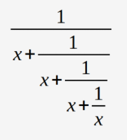
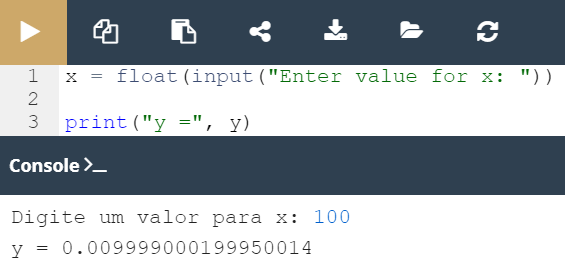

## 2.6.1.10 Lab: Operadores e Expressões

#### Objetivo

 - familiarizar-se com a função `print()` e as suas capacidades de formatação;
 - compreender a precedência e associatividade dos operadores Python, bem como o uso adequado de parêntesis;

#### Cenário
A sua tarefa é a de completar o código, de forma a avaliar a seguinte expressão:

*Prioridades que devem ser seguidas*

####  Resultado

**Código fornecido:**

```python
x = float(input("Enter value for x: "))

# Write your code here.
print("y =", y)
```

**Resultado ápos as devidas modificações no código:**


```python
x = float(input("Digite um valor para x: "))
y = (1/((1/((1/((1/x)+ x))+ x))+ x))

# output
print("y =", y)
```



*Lab: Visualização da aplicação do código*

>***Fonte**: Curso Python Essentials oferecido pela Python Institute*