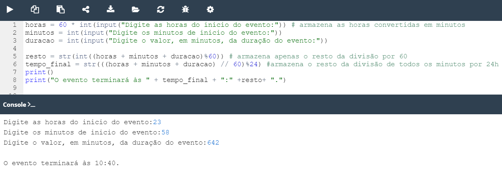

## 2.6.1.11 Lab: Operadores e Expressões

#### Objetivo

- melhorar a capacidade de utilizar números, operadores, e operações aritméticas em Python;
- utilizar as capacidades de formatação da função ``print()`` ;
- aprender a expressar os fenómenos da vida quotidiana em termos de linguagem de programação.

#### Cenário

A sua tarefa é preparar um código simples capaz de avaliar o **tempo final** de um período de tempo, dado como um número de minutos (pode ser arbitrariamente grande). O tempo inicial é dado como um par de horas (0.. 23) e minutos (0.. 59). O resultado tem de ser impresso para a consola.

Por exemplo, se um evento começar às **12:17** e durar **59 minutos**, ele terminará às **13:16**.

Não se preocupe com quaisquer imperfeições no seu código - não faz mal se aceitar um tempo inválido - o mais importante é que o código produza resultados válidos para dados de input válidos.

Teste o seu código com cuidado. Dica: utilizar o operador ``%`` pode ser a chave para o sucesso.

####  Resultado

**Código de teste:**

```python
12
17
59

# output esperado
13:16
```

**Código de fornecido:**

```python
hour = int(input("Starting time (hours): "))
mins = int(input("Starting time (minutes): "))
dura = int(input("Event duration (minutes): "))

# Write your code here.
```

**Resultado ápos as devidas modificações no código:**


*Lab: Operadores e expressões - Conversão de horas*

>***Fonte**: Curso Python Essentials oferecido pela Python Institute*