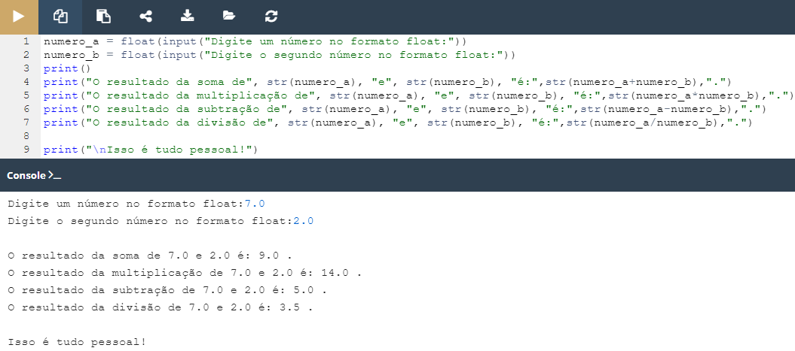

## 2.5.1.1 Lab: Comentários

#### Objetivo

 - familiarizar-se com a função `print()` e as suas capacidades de formatação;
 - avaliar expressões simples;

#### Cenário

A sua tarefa é completar o código a fim de avaliar os resultados de quatro operações aritméticas básicas.

Os resultados têm de ser impressos para a consola.

Poderá não conseguir proteger o código de um utilizador que queira dividir por zero. Tudo bem, não se preocupe com isso por agora.

Teste o seu código - produz os resultados que espera?
Não lhe mostraremos quaisquer dados de teste - isso seria demasiado simples.

####  Resultado

**Código fornecido:**

```python
# input a float value for variable a here
# input a float value for variable b here

# output the result of addition here
# output the result of subtraction here
# output the result of multiplication here
# output the result of division here

print("\nThat's all, folks!")
```

**Resultado ápos as devidas modificações no código:**




*Lab: Input e output simples*

>***Fonte**: Curso Python Essentials oferecido pela Python Institute*