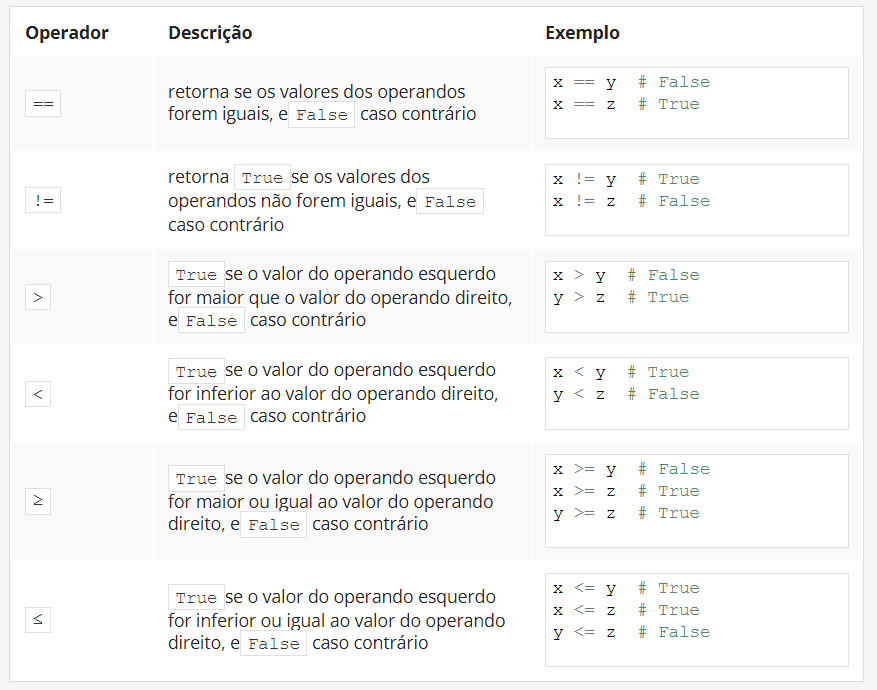

## 3.1.1.13 Resumo da Secção

### Key takeaways

1. Os operadores de **comparação** (ou os chamados *relacionais*) são usados para comparar valores. A tabela abaixo ilustra como os operadores de comparação funcionam, assumindo que ``x = 0``, ``y = 1``, e ``z = 0``:


*Tabela contendo os opradores relacionais*


2. Quando quiser executar algum código apenas se uma determinada condição for cumprida, pode usar uma **declaração condicional**:


- uma únicaif declaração, por exemplo:
  

```python
x = 10

if x == 10: # condition
    print("x is equal to 10")  # Executed if the condition is True.
```


- uma série de if declarações, por exemplo:

```python
x = 10

if x > 5: # condition one
    print("x is greater than 5")  # Executed if condition one is True.

if x < 10: # condition two
    print("x is less than 10")  # Executed if condition two is True.

if x == 10: # condition three
    print("x is equal to 10")  # Executed if condition three is True.
```

Cada ``if`` declaração é testada separadamente.

- uma if-elsedeclaração, por exemplo:
```python
x = 10

if x < 10:  # Condition
    print("x is less than 10")  # Executed if the condition is True.

else:
    print("x is greater than or equal to 10")  # Executed if the condition is False.

```
- uma série de if declarações seguidas por um else, por exemplo:


```python
x = 10

if x > 5:  # True
    print("x > 5")

if x > 8:  # True
    print("x > 8")

if x > 10:  # False
    print("x > 10")

else:
    print("else will be executed")
```

Cada ``if`` é testado separadamente. O corpo de ``else`` é executado se o último ``if`` for ``False``.

- A ``if-elif-else`` declaração, por exemplo:

```python
x = 10

if x == 10:  # True
    print("x == 10")

if x > 15:  # False
    print("x > 15")

elif x > 10:  # False
    print("x > 10")

elif x > 5:  # True
    print("x > 5")

else:
    print("else will not be executed")
```
Se a condição ``if`` for ``False``, o programa verifica as condições dos ``elif`` blocos subsequentes - o primeiro ``elif`` bloco que True é executado. Se todas as condições forem ``False``, o ``else`` bloco será executado.

- Declarações condicionais nested, por exemplo:
  

```python
x = 10

if x > 5:  # True
    if x == 6:  # False
        print("nested: x == 6")
    elif x == 10:  # True
        print("nested: x == 10")
    else:
        print("nested: else")
else:
    print("else")
```


### Exercício 1

Qual o output do seguinte snippet?

```python
x = 5
y = 10
z = 8

print(x > y)
print(y > z)

#output

False
True
```

### Exercício 2

Qual o output do seguinte snippet?

```python
x, y, z = 5, 10, 8

print(x > z)
print((y - 5) == x)

#output

False
True
```

### Exercício 3

Qual o output do seguinte snippet?

```python
x, y, z = 5, 10, 8
x, y, z = z, y, x

print(x > z)
print((y - 5) == x)

#output

True
False
```

### Exercício 4

Qual o output do seguinte snippet?

```python
x = 10

if x == 10:
    print(x == 10)
if x > 5:
    print(x > 5)
if x < 10:
    print(x < 10)
else:
    print("else")

#output

True
True
else
```

### Exercício 5

Qual o output do seguinte snippet?

```python
x = "1"

if x == 1:
    print("one")
elif x == "1":
    if int(x) > 1:
        print("two")
    elif int(x) < 1:
        print("three")
    else:
        print("four")
if int(x) == 1:
    print("five")
else:
    print("six")

#output

four
five
```

### Exercício 6

Qual o output do seguinte snippet?

```python
x = 1
y = 1.0
z = "1"

if x == y:
    print("one")
if y == int(z):
    print("two")
elif x == y:
    print("three")
else:
    print("four")

#output

one 
two
```


>***Fonte**: Curso Python Essentials oferecido pela Python Institute*