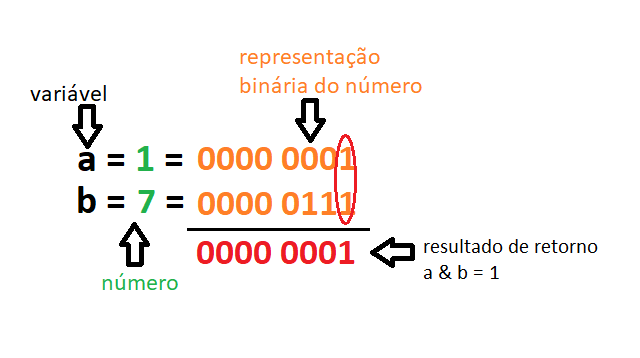

## 3.3.1.1 Operações de lógica e bit em Python | and, or, not

### Lógica de computador 

Os exemplos que usamos até agora, durante nossas práticas são bem **simples** e não representam a vida real. As situações da vida real são bem mais **complexas** e para representá-las necessitaremos de um conjunto novo de ferramentas, os **operadores lógicos**.

**Observe a frase:** *"Se tivermos algum tempo livre, ``e`` o tempo estiver bom, vamos dar um passeio."*

Nesse exemplo, usamos a conjunção ``and (e)``, podemos até, em uma primeira leitura não dar muita importância a ela, mas eu garanto que ela é mega **importante**. A conjunção ``and``, nessa frase, indica que *dar um passeio* dependende do **cumprimento simultâneo** destas duas condições(Se tivermos algum tempo livre e se o tempo estiver bom). Essa idéia de ligação de condições, na lógica, é chamada de **conjunção**.

**Observe a frase:** *Se estiveres no centro comercial ``ou`` eu estiver no centro comercial, um de nós vai comprar um presente para a mãe.*


Agora temos o aparecimento da palavra ``or(ou)`` e ela indica que a compra depende de pelo menos uma das condições apresentadas. Na lógica essa idéia, de um **ou** outro, é chamada de **disjunção**.

### Conjunção: and (e)

A palavra ``and`` em Python é reconhecida como o operador da **conjunção lógica** que também, pode ser representada pela letra ``e``. Este é um operador binário com **prioridade inferior a dos operadores de comparação**.O resultado do operador ``and`` é determinado a partir de sua [tabela verdade](https://www.todamateria.com.br/tabela-verdade/).

Analise a situação proposta para entender melhor sobre o valor lógico: ***Hojé é segunda ``e`` amanhã choverá***

Para facilitar o aprendizado, dividiremos a frase acima em duas proposições, formadas pela expressão que vem antes e depois da conjunção ``and``. 

``A) Hoje é segunda, B) amanhã choverá``.


|Proposição A |Proposição B  |A ``and`` B  |
|---------|---------|---------|
|**True**   |   **True**      |  **True**       |
|True     | False          |   False        |
|False     |   True      |    False       |
|False  |  False         |   False        |

O **valor lógico da conjunção** sempre **será verdadeiro** quando ambas as proposições forem verdadeiras (True ou 1), caso contrário assumirá o valor falso (False ou 0), como destacado na tabela acima.

> **Nota:**

### Disjunção: or (ou / v)

O operador de disjunção do Python é a palavra ``or``, que também pode ser represetanda pela palavra ``ou`` e pelo símbolo ``v``. Ele é um **operador binário com prioridade inferior** a ``and``.

Analise a situação proposta para entender o valor lógico: ***Tiago é médico ``ou`` João é engenheiro***.

A divisão dessa frase em duas proposições, resulta :
``A)Tiago é médico, B) João é engenheiro``

|Proposição A |Proposição B  |A ``or`` B  |
|---------|---------|---------|
|True   |   True      |  True       |
|True     | False          |   True        |
|False     |   True      |    True      |
|**False**  |  **False**         |   **False**        |

O **valor lógico da disjunção** sempre **será falso** quando ambas as proposições forem falsas(False), como destacado na tabela acima.

### Negação: not

O **operador de negação** é um operador **unário** que executa uma negação lógica e também é usado para construir condições. É representado pela palavra ``not``.Ele é aplicado para ``inverter o valor lógico`` de uma proposição, ou seja, a proposição com o valor ``True`` após sua utilização terá valor ``False`` e vice e versa.

O operador escrito com a palavra ``not`` possui uma **prioridade muito alta**.

|Proposição A |``not`` A |
|---------|---------|---------|
|True   |   False      |
|False     | True|  

### Expressões Lógicas - Leis de De Morgan

Você já conhece as **leis de De Morgan**? Em caso negativo, tire um tempinho para ler esse [artigo](leis-de-morgan-tudo-que-voce-precisa-saber-para-o-seu-concurso). Aprender esse assunto vai te fazer poupar algum tempo durante a programação de códigos mais extensos.

De uma forma mais objetiva, as leis de De Morgan dizem que:
 - A **negação de uma conjunção** é a disjunção das negações;
 - A **negação de uma disjunção** é a conjunção das negações;

Como escreveriamos isso em Python?
```python
not (p and q) == (not p) or (not q)
not (p or q) == (not p) and (not q)
```
No exemplo acima ``p`` e ``q`` são proposições e os parenteses foram colocados para melhorar a legibilidade.

### Valores lógicos vs. bits únicos

Os operadores lógicos tratam o valor do seus argumentos como um todo, ou seja, quando ``False`` eles estão conscientes que todos os bits foram redefinidos, **zero**. Quando pelo menos um bit **não é zero**, ele reconhece como ``True``.

Porém quando desejamos operar sobre o valor de **bit a bit** devemos fazer uso dos **operadores bitwise**.

### Operadores bitwise

Existem quatro operadores que nos permitem **manipular bits únicos de dados**. Eles são conhecidos como **bitwise** e abragem todas as operações já mencionadas, anteriormente, no contexto lógico, como também um **operador adicional** o ``xor``(conhecido como o **ou/or exclusivo**), denotado como ``^``.

Os operadores **bitwise** são:
- ``&`` (e comercial) - conjunção bitwise;
- ``|`` (barra) - disjunção bitwise;
- ``~`` (till) - negação bitwise;
- ``^`` (acento circunflexo) - bitwise exclusive ou (xor)

**Operadores bitwise (``&``,``|``,``^``)**


|Proposição A  |Proposição B |A ``&`` B|A l B |A ``^`` B | 
|:---------:|:---------:|:---------:|:---------:|:---------:| 
|`0`     |    `0`      |    `0`      |     `0`     |    `0`        | 
|`0`     |    `1`     |   `0`       |     `1`    |    `1`    | 
|`1`      |    `0`      |     `0`     |    `1`     |   `1`    | 
|`1`    |   `1`      |   `1`   |    `1`     |     `0`   | 


**Operadores bitwise (~)**

|Proposição A   |``~`` Proposição A   |
|---------|---------|
|`0`     |    `1`     |
|`1`     |    `0`    |


> **Nota:**
> Saiba mais sobre os operadores **bitwise** clicando [aqui](https://brito.blog.incolume.com.br/2019/09/python-operadores-bitwise-com-exemplos.html) e [aqui](https://imasters.com.br/desenvolvimento/conheca-os-operadores-bitwise-bit-bit).

Para facilitar as coisas:

- ``&`` requer exatamente dois ``1`` para fornecer ``1`` como resultado;
- ``|`` requer pelo menos um ``1`` para fornecer ``1`` como resultado;
- ``^`` requer exatamente um ``1`` para fornecer ``1`` como resultado.

Os operadores **bitwise** são muito rigorosos **eles lidam com cada bit separadamente**. Se assumirmos que uma variável inteira ocupa 8 bits(cenário comum nos sistemas modernos), podemos imaginar a operação bitwise como uma avaliação de 8 vezes do operador lógico para cada par de bits, como demonstrado na figura abaixo:



> **Nota:**
> Os argumentos ou proposições destes operadores devem ser **inteiros**; não devemos utilizar **float** aqui.> A diferença entre os operadores lógicos e de bit é importante: **os operadores lógicos não penetram no nível de bits do seu argumento**. Eles só se preocupam com o valor final.

Operações lógicas versus bit


>***Fonte**: Curso Python Essentials oferecido pela Python Institute*