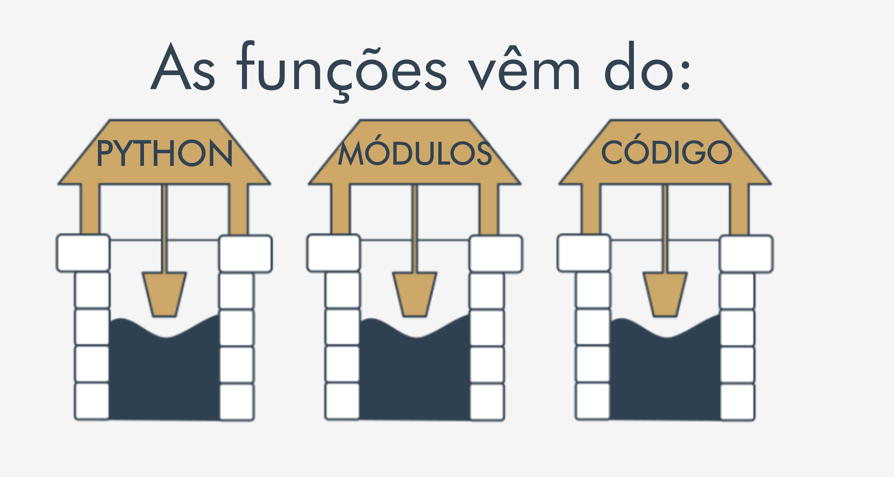
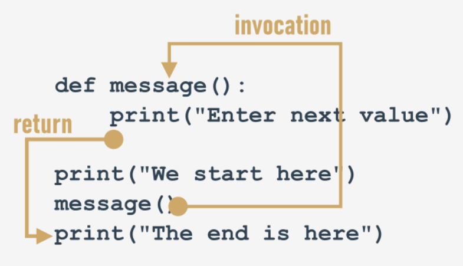

## 4.1.1.1 Funções

### Porque precisamos de funções ?

Durante o curso você aprendeu a invocar algumas funções como, o ``print`()`` utilizado para imprimir um valor na tela. Quando se quer ler um valor, usamos o ``input()``, juntamente com o ``int()`` e o ``float()``.

Agora você aprenderá a escrever suas proprias funções e como utilizá-las.
A criação e utilização das funções é bastante indicado para aquelas situações onde necessitamos que haja **repetição no código**. **Sua utilização facilitará a correção e também ajudará na decomposição de problemas de maior complexidade e problemas menoras**.

### Decomposição

Imagine uma situação onde é necessário criar um código para executar uma tarefa tão extensa de forma a ser necessário dividi-lo entre uma equipe. Dessa forma, cada um deles precisará escrever parte do código, que quando combinado resolverá o problema proposto. Nesse caso, a decomposição será nossa melhor amiga.

### De onde vêm as funções?

No geral, as funções vêm de três lugares:

- **do próprio Python** - funções como ``print()`` são parte integrante do Python e sempre estão disponíveis sem qualquer esforço adicional. **Funções** dessa natureza são chamadas de **Integradas**;
- **dos módulos pré-instalados do Python** - muitas funções, estão disponíveis em vários módulos instalados juntamente com o Python; a utilização destas funções requer alguns passos adicionais do programador para as tornar totalmente acessíveis;
- **diretamente do seu código** - pode escrever as suas funções, colocá-las dentro do seu código e utilizá-lás livremente;
- existe uma outra possibilidade, mas está ligada as classes...então por enquanto vamos omiti-lá;

<center>



</center>

### A sua primeira função

Observe o código abaixo:

```python
print("Enter a value: ")
a = int(input())

print("Enter a value: ")
b = int(input())

print("Enter a value: ")
c = int(input())
```

O código apresentado sempre irá usar a função ``input()`` para receber um valor e a função ``print()`` para pedir um valor. Utilizando o artifício das funções, podemos escrever esse mesmo código de uma forma bem menor. **Como podemos fazer tal função?**

```python
def function_name():
    # corpo da função
```
- Devemos sempre começar com a keyword ``def``, para definir a função;
- Após o ``def`` indicamos o ``nome da função``;
- Após o ``nome da função`` usamos um par de ``parêntesis``
- A linha tem de ser terminada com ``dois pontos``;
- A linha posicionada após a linha contendo ``def`` irá receber o ``corpo da função``

Agora vamos **definir a função** para resolver nosso problema. Chamaremos essa função de ``mensagem``.

```python
def mensagem():
    print("Enter a value: ")

print("We start here.")
print("We end here.)

#output
We start here.
We end here.
```

Observe que o output apresenta as mensagens mostradas pelo ``print()``, mas não apresenta a mensagem do ``print(``) que se encontra `**dentro da função que criamos**`. Para que a mensagem "``Enter a value:`` " seja executada precisamos **invocar a função mensagem()** para que então, ela seja chamada pelo código e consequentemente executada. Para isso devemos modificar nosso código da seguinte maneira:

```python
def mensagem():
    print("Enter a value: ")

print("We start here.")
mensagem()   # Invocação da função através da escrita do seu nome
print("We end here.)

#output
We start here.
Enter a value:
We end here.
```

### Como funcionam as funções no Python

Para invocar funções no Python é importante **ter em mente dois conceitos**:

<center>



</center>

 - **Não se deve invocar** uma função que não seja conhecida no momento da invocação. Devemos lembrar que o Python ler o código de cima para baixo, dessa forma é importante que a chamada e a declaração da funções estejam próximas uma da outra.

 - **Não se deve ter uma função** e uma variável com o mesmo nome pois isso pode fazer com que o Python esqueça o nome da função.


>***Fonte**: Curso Python Essentials oferecido pela Python Institute*